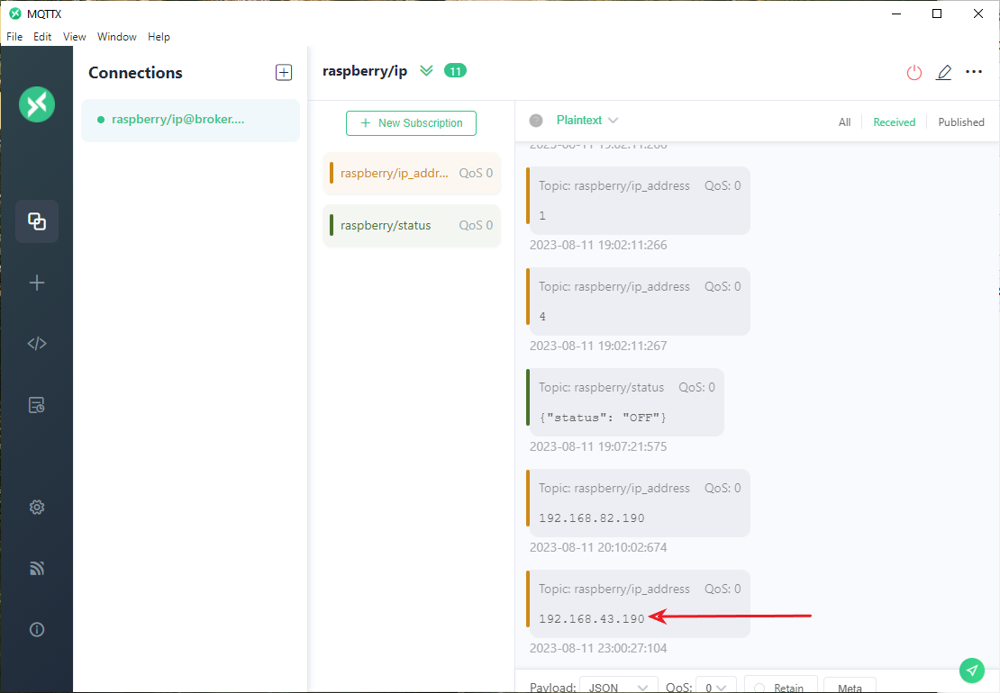

# savannaTrace
Raspberry MQTT Solution

## Problem statement
---

## Approach
---
I use the Raspberry Pi as the end device that will be used to publish messages to the broker.
The user device, either a laptop, smartphone or any other device, will subscribe to the same topic that the Pi
publishes to.

The moment we connect the Pi to a WiFi network, we get the IP address, and save it into a message variable.
This variable is what we publish as a message to the raspberry/ip topic. 

The subscribed device can then get this IP address.

Based on the problem statement, the parameters used are as follows:
1. Broker: broker.emqx.io
2. Port: 1883
3. Topic: raspberry/ip_address

## Program flowchart
---

## Tests
---
I used a Raspberry Pi model 4B and the open source MQTTX application to perform tests. Below are the screenshots of these tests.

### Raspberry Pi terminal publishing the IP address

### MQTTX application receiving message

## Web Application
---
I used the Laravel framework to build the web app.
